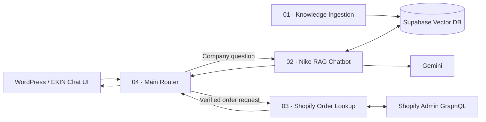

# EKIN — AI Commerce Support System

> A modular n8n internship project combining retrieval-augmented generation, Supabase vector search, secure Shopify test-order lookup, and a WordPress-facing chatbot router.


## Overview

EKIN is a multi-workflow customer-support architecture built as an internship project. It supports two different classes of requests through one conversational interface:

1. **Company knowledge questions** are answered through a grounded RAG pipeline backed by Supabase and Gemini embeddings.
2. **Order-status requests** are handled through a Shopify test-order workflow that verifies the checkout email before exposing order information.

A fourth workflow acts as the public control plane, normalizing frontend input and routing each request to the correct backend path.

This is intentionally not a single "AI chatbot" workflow. The system separates ingestion, retrieval, private commerce access, and request routing so each component can be tested, secured, and maintained independently.

## Architecture



See [`docs/architecture.md`](docs/architecture.md) for the detailed request lifecycle.

## The four n8n workflows

| Workflow | Purpose |
|---|---|
| **01 — Company Knowledge Ingestion** | Uploads a company document, splits it into retrieval-friendly chunks, creates Gemini embeddings, and inserts them into Supabase. |
| **02 — Nike RAG Chatbot** | Uses `match_documents` to retrieve relevant context and generates concise answers grounded in the stored Nike knowledge corpus. |
| **03 — Shopify Order Lookup** | Normalizes input, queries Shopify test orders through Admin GraphQL, verifies the checkout email, and returns structured order data only after verification. |
| **04 — EKIN Main Chatbot Router** | Accepts website messages, detects order intent, gathers missing order fields, routes to Workflow 02 or 03, and normalizes the final response. |

The importable JSON exports are in [`workflows/`](workflows/).

## Supabase RAG layer

The live project uses:

- `public.documents`
- `vector(3072)` embeddings
- Gemini `models/gemini-embedding-001`
- HNSW cosine indexing through `halfvec(3072)`
- GIN metadata indexing
- `public.match_documents(...)`
- RLS enabled
- server-side service-role access from n8n

The reproducible SQL is in [`supabase/setup.sql`](supabase/setup.sql).

## Security model

Order lookup is deliberately separated from public company knowledge.

A Shopify order is only returned when:

- the request contains a valid order number,
- the request contains a valid checkout email,
- the exact order exists in the Shopify test-order search,
- the stored order email exactly matches the supplied email, and
- the child workflow returns `verified: true`.

The router performs a second verification gate before forwarding order fields to the website.

See [`SECURITY.md`](SECURITY.md).

## Tech stack

- **n8n** — workflow orchestration and public webhooks
- **Supabase / PostgreSQL / pgvector** — RAG document and vector storage
- **Google Gemini** — embeddings and grounded answer generation
- **Shopify Admin GraphQL** — test-order retrieval
- **WordPress** — customer-facing EKIN chatbot integration
- **HTTPS tunneling during local deployment** — public connectivity between WordPress and local n8n

## Repository structure

```text
ekin-commerce/
├── workflows/
│   ├── 01-company-knowledge-ingestion.json
│   ├── 02-nike-rag-chatbot.json
│   ├── 03-shopify-order-lookup.json
│   ├── 04-ekin-main-chatbot-router.json
│   └── README.md
├── supabase/
│   ├── setup.sql
│   └── README.md
├── docs/
│   ├── architecture.md
│   ├── testing.md
│   └── screenshots/
│       └── README.md
├── knowledge-base/
│   └── README.md
├── config/
│   └── .env.example
├── SECURITY.md
├── NOTICE.md
├── .gitignore
└── README.md
```

## Setup

### 1. Supabase

Run [`supabase/setup.sql`](supabase/setup.sql) in the target Supabase project.

The workflow is designed for a 3072-dimensional embedding column. Ensure the database schema matches the embedding model configuration.

### 2. Import n8n workflows

Import the four files from [`workflows/`](workflows/) in numerical order.

After import:

- configure the Supabase credential,
- configure the Google Gemini credential,
- configure private Shopify credentials,
- re-select Workflows 02 and 03 inside Workflow 04's **Execute Workflow** nodes,
- activate child workflows, then the main router.

### 3. Ingest the knowledge corpus

Run Workflow 01 and upload the company knowledge document.

### 4. Test RAG

Ask a question covered by the stored corpus and verify that the RAG agent retrieves context from Supabase before answering.

### 5. Test Shopify

Use a Shopify **test order**.

Test both:

- correct order + correct checkout email,
- correct order + wrong checkout email.

The second test must not reveal protected order information.

### 6. Connect the frontend

Point the WordPress/EKIN chatbot to Workflow 04's production webhook URL.

## Testing

A reusable acceptance checklist is available at [`docs/testing.md`](docs/testing.md).

Core tests completed during the project included:

- successful knowledge ingestion,
- grounded RAG answers,
- unsupported-question fallback,
- valid test-order lookup,
- wrong-email privacy rejection,
- malformed-input rejection,
- router classification,
- WordPress-to-n8n webhook integration.

## Public repository safety

The workflow exports in this repository are **sanitized**:

- real Shopify credentials removed,
- n8n credential references removed,
- Supabase/Gemini secrets not included,
- instance-specific workflow metadata removed where practical,
- router child-workflow bindings cleared for portable import.

Use [`config/.env.example`](config/.env.example) only as a configuration inventory. Never commit real secrets.

## Project status

**Completed internship project / portfolio demonstration.**

The final system demonstrates modular automation, RAG retrieval, API integration, privacy-aware order verification, backend routing, failure handling, and web delivery in one end-to-end architecture.

## Disclaimer

EKIN is an independent educational project. The Nike knowledge demo is not affiliated with, endorsed by, or operated by NIKE, Inc. Shopify order functionality is demonstrated with test-order logic.

See [`NOTICE.md`](NOTICE.md).
