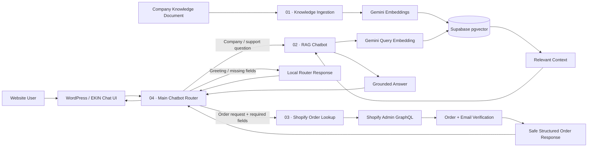

# EKIN — AI Commerce Support System

> A modular AI customer-support architecture built with **n8n, Supabase, Google Gemini, Shopify, and WordPress**. EKIN combines retrieval-augmented generation (RAG) for company knowledge with privacy-aware Shopify order lookup behind one website chatbot.


## Why EKIN Exists

A real support chatbot should not treat every question the same way.

Some requests are **public knowledge questions** such as company information, products, returns, sizing, or sustainability. Others involve **private commerce data** such as an individual customer's order status and tracking information.

EKIN separates those responsibilities into independent workflows and routes each request to the correct backend path:

- **Company questions → RAG** using Gemini embeddings + Supabase vector search.
- **Order questions → Shopify** only after the order number and checkout email are verified.
- **Website requests → Router** that detects intent, collects missing fields, invokes the correct child workflow, and normalizes the final response.

The result is a single conversational interface backed by multiple specialized automation workflows rather than one oversized chatbot flow.

---

## System Architecture



Detailed request flow: [`docs/architecture.md`](docs/architecture.md)

---

## Core Workflows

| # | Workflow | Responsibility | Key Engineering Idea |
|---|---|---|---|
| **01** | **Company Knowledge Ingestion** | Uploads company documents, loads text, splits content, creates Gemini embeddings, and stores vectors + metadata in Supabase. | Knowledge ingestion is isolated from query-time RAG. |
| **02** | **Nike RAG Chatbot** | Embeds the user's question, retrieves relevant chunks through `match_documents`, and generates an answer constrained to retrieved context. | The LLM is grounded instead of answering Nike facts from general model memory. |
| **03** | **Shopify Order Lookup** | Validates input, queries Shopify test orders through Admin GraphQL, verifies checkout email, and returns a reduced order response. | Private order data is protected behind an exact identity-verification gate. |
| **04** | **EKIN Main Chatbot Router** | Normalizes website input, distinguishes company vs. order intent, gathers missing order fields, invokes the correct child workflow, and standardizes output. | One frontend can safely orchestrate multiple specialized backend capabilities. |

Importable n8n JSON exports: [`workflows/`](workflows/)

---

## Request Lifecycle

### Company knowledge request

```text
User question
   ↓
Workflow 04 — Main Router
   ↓
Workflow 02 — RAG Chatbot
   ↓
Gemini query embedding
   ↓
Supabase match_documents()
   ↓
Relevant Nike knowledge chunks
   ↓
Gemini grounded answer
   ↓
Normalized response → Website
```

### Order lookup request

```text
Order number + checkout email
   ↓
Workflow 04 — Main Router
   ↓
Workflow 03 — Shopify Lookup
   ↓
Input validation + normalization
   ↓
Shopify Admin GraphQL
   ↓
Exact order match
   ↓
Exact checkout-email verification
   ↓
Safe order fields only
   ↓
Workflow 04 verification gate
   ↓
Website response
```

---

## RAG / Supabase Layer

The live project uses a PostgreSQL + pgvector retrieval layer with:

- `public.documents`
- `vector(3072)` embeddings
- Gemini `models/gemini-embedding-001`
- HNSW cosine index using `halfvec(3072)`
- GIN metadata index
- `public.match_documents(...)`
- Row Level Security enabled
- server-side Supabase access from n8n

The database setup is reproducible from:

[`supabase/setup.sql`](supabase/setup.sql)

The demo corpus is included as:

[`knowledge-base/Nike_Public_Knowledge_Base_RAG.md`](knowledge-base/Nike_Public_Knowledge_Base_RAG.md)

### Why metadata is stored with each chunk

Workflow 01 attaches information such as company, document category, source filename, and ingestion time. This keeps retrieved chunks traceable and makes the vector store easier to filter or extend later.

---

## Security & Privacy Design

The order path was intentionally designed differently from the public RAG path.

### Order verification

Order information is returned only when all of the following are true:

1. A valid order number is provided.
2. A valid checkout email is provided.
3. Shopify returns the requested test order.
4. The stored order email exactly matches the supplied email.
5. Workflow 03 returns `verified: true`.
6. Workflow 04 independently checks the verification result before forwarding order fields.

For failed verification, the workflow returns a generic response instead of revealing whether the order number or email was the incorrect field.

### Additional controls

- Credentials are kept server-side rather than exposed in the website frontend.
- The public repository contains **sanitized workflow exports** only.
- Shopify test-order queries are separated from company knowledge retrieval.
- RAG answers are instructed to use retrieved context rather than unrestricted model knowledge.
- Invalid or incomplete input is handled through explicit fallback responses.
- The router returns only the data required by the frontend rather than forwarding raw backend responses.

Full security notes: [`SECURITY.md`](SECURITY.md)

---

## Testing Performed

The completed project was tested across both functional and privacy-sensitive paths.

| Test | Expected Behaviour | Result |
|---|---|---|
| Knowledge document ingestion | Document is chunked, embedded, and stored in Supabase | ✅ Passed |
| Company question | Relevant context is retrieved before answer generation | ✅ Passed |
| Unsupported knowledge question | Bot uses fallback rather than inventing information | ✅ Passed |
| Correct order + correct email | Structured order information is returned | ✅ Passed |
| Correct order + wrong email | No protected order information is exposed | ✅ Passed |
| Invalid input | User receives a safe validation response | ✅ Passed |
| Order-intent routing | Request is sent to Shopify workflow | ✅ Passed |
| Company-intent routing | Request is sent to RAG workflow | ✅ Passed |
| WordPress → n8n integration | Website request reaches router webhook and receives response | ✅ Passed |

Reusable acceptance checklist: [`docs/testing.md`](docs/testing.md)

---

## Tech Stack

| Technology | Role in EKIN |
|---|---|
| **n8n** | Workflow orchestration, webhooks, routing, validation, API calls, and sub-workflow execution |
| **Supabase** | PostgreSQL database, pgvector document storage, metadata storage, and similarity search |
| **Google Gemini** | 3072-dimensional embeddings and grounded answer generation |
| **Shopify Admin GraphQL API** | Test-order retrieval, fulfilment data, tracking information, and line items |
| **WordPress** | Customer-facing chatbot interface |
| **HTTPS tunneling** | Connected local development services to the website during integration testing |

---

## Engineering Challenges Solved

### 1. Keeping RAG and order lookup separate

A single LLM agent should not have unrestricted access to both public knowledge and customer commerce data. EKIN uses different workflows and data boundaries for each path.

### 2. Shopify GraphQL request formatting

The order workflow required debugging query structure, request payloads, authentication, and order-search behaviour before the test-order lookup executed reliably.

### 3. Preventing order-data leakage

An order number alone is not treated as sufficient proof. The workflow validates the checkout email against the Shopify response and deliberately uses a generic failure message when verification fails.

### 4. Routing natural-language requests

Users do not always send clean JSON fields. Workflow 04 accepts multiple frontend field names and can extract order numbers and email addresses from natural-language messages before deciding where to route the request.

### 5. Connecting local automation to a website

The project connected a WordPress frontend to an n8n webhook during local development through a public HTTPS tunnel, allowing the full browser → router → backend → browser path to be tested.

---

## Repository Structure

```text
ekin-commerce/
├── workflows/
│   ├── 01-company-knowledge-ingestion.json
│   ├── 02-nike-rag-chatbot.json
│   ├── 03-shopify-order-lookup.json
│   ├── 04-ekin-main-chatbot-router.json
│   └── README.md
│
├── supabase/
│   ├── setup.sql
│   └── README.md
│
├── knowledge-base/
│   ├── Nike_Public_Knowledge_Base_RAG.md
│   └── README.md
│
├── docs/
│   ├── architecture.md
│   ├── testing.md
│   └── screenshots/
│       └── README.md
│
├── config/
│   └── .env.example
│
├── SECURITY.md
├── NOTICE.md
├── LICENSE
├── .gitignore
└── README.md
```

---

## Reproducing the Project

### 1. Create the Supabase vector layer

Run:

[`supabase/setup.sql`](supabase/setup.sql)

This creates the schema required by the workflows, including the 3072-dimensional vector column and `match_documents` function.

### 2. Import the n8n workflows

Import the JSON files from [`workflows/`](workflows/) in numerical order.

### 3. Configure credentials privately

Create n8n credentials for:

- Supabase
- Google Gemini
- Shopify

Do **not** hard-code real secrets into workflow exports intended for GitHub.

### 4. Connect child workflows

Inside Workflow 04, re-select:

- Workflow 02 in the Nike RAG execution node
- Workflow 03 in the Shopify execution node

### 5. Ingest the knowledge base

Run Workflow 01 and upload a supported document such as the included Nike public knowledge corpus.

### 6. Activate and test

Activate the child workflows first, then Workflow 04.

Recommended minimum tests:

```text
Company question → grounded answer
Unknown company question → fallback
Correct order + correct email → success
Correct order + wrong email → blocked
Missing email/order number → clarification
```

### 7. Connect a frontend

Send website chat messages to Workflow 04's production webhook and render the normalized JSON response in the frontend.

---

## Example Capabilities

EKIN can support interactions such as:

```text
"What does Nike Membership include?"
"How do Nike returns work?"
"Tell me about Nike sustainability initiatives."
"Where is my order #1001? My checkout email is user@example.com"
```

The first three requests are routed through RAG. The final request is routed through the private Shopify verification path.

---

## What This Project Demonstrates

This project goes beyond a single chatbot prompt and demonstrates:

- modular n8n workflow architecture,
- retrieval-augmented generation,
- vector databases and embedding search,
- REST/webhook-style integration,
- Shopify GraphQL integration,
- input validation and normalization,
- privacy-aware backend design,
- multi-workflow routing,
- safe failure handling,
- WordPress integration,
- end-to-end system testing.

## Project Status

**Completed internship project / portfolio demonstration.**

The current repository contains the sanitized workflow exports, database setup, RAG corpus, architecture notes, testing documentation, configuration template, and security documentation required to understand and reproduce the system.

---

## License

The original code, workflow logic, SQL, and project documentation authored for EKIN are released under the **MIT License**. See [`LICENSE`](LICENSE).

Third-party trademarks, brand names, and third-party source material are not granted or relicensed by the MIT License. See [`NOTICE.md`](NOTICE.md).

## Disclaimer

EKIN is an independent educational internship/portfolio project. It is not produced, approved, endorsed, sponsored, or operated by NIKE, Inc. The Nike-related RAG demonstration uses publicly available material for educational retrieval testing. Nike and related marks remain the property of their respective owners.

The Shopify integration demonstrates test-order lookup and should not be interpreted as an official Nike order system.
