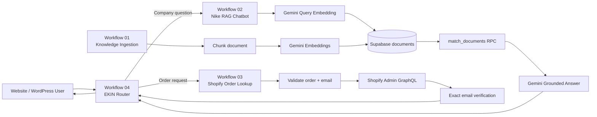

# Architecture

## Design decisions

### Separation of concerns
The project uses four workflows instead of one oversized automation. Ingestion, knowledge retrieval, commerce lookup, and routing can be tested independently.

### Grounded knowledge path
Nike-related factual questions are routed to a RAG workflow. The language model is instructed to use the Supabase retrieval tool before answering and to fall back when the stored corpus does not contain the answer.

### Verified order path
Order details are treated as private data. Workflow 03 requires both an order identifier and the checkout email. A valid order number alone is not enough to disclose order fields.

### Router as control plane
The main webhook accepts several frontend-friendly field names, normalizes them, detects personal-order intent, gathers missing fields when necessary, and invokes only the required child workflow.
